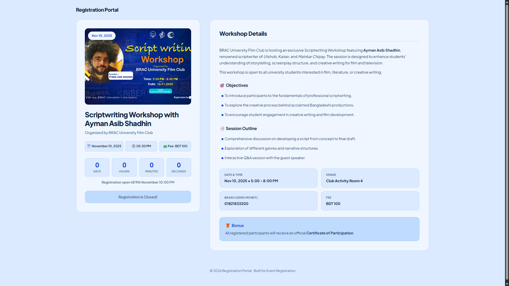

# 🎫 General Registration Portal

A clean, responsive, modern web registration portal designed for events, workshops, and seminars.

## Preview



🔗 **Live Demo**: [general-registration.vercel.app](https://general-registration.vercel.app/)

---


---

## ✨ Features

- 📅 **Interactive Live Countdown**: Real-time event countdown timer calculating days, hours, minutes, and seconds remaining until registration close.
- ⏱️ **Automated Registration Closure**: Automatically disables registration buttons and locks the form once the deadline in `config.js` is reached.
- 📋 **Structured Multi-Step Registration Form**: Gathers attendee information, questionnaires, and payment verification via a clean 2-column input layout.
- 🎟️ **Instant Digital Ticket Pass**: Generates a custom styled official entry pass dynamically populated with attendee registration data.
- 📥 **One-Click Ticket Download**: Allows attendees to download their entry ticket as a high-quality `.JPG` image powered by `html2canvas`.
- 📊 **Serverless Backend (Google Apps Script)**: Asynchronously stores registration responses directly into Google Sheets.
- 🎨 **Modern Wide Design System**: Clean Light Blue palette (`#dbeafe`), Plus Jakarta Sans typography, and responsive layout.

---

## 🛠️ Tech Stack

- **Frontend**: HTML5, Vanilla CSS3 (Custom Design System, Flexbox, CSS Grid)
- **Scripting**: JavaScript (ES6+, Async Fetch API)
- **Backend/Storage**: Google Apps Script & Google Sheets
- **Libraries**: [html2canvas](https://html2canvas.hertzen.com/) (Ticket screenshot generation)
- **Fonts**: [Plus Jakarta Sans](https://fonts.google.com/specimen/Plus+Jakarta+Sans) via Google Fonts

---

## 📁 Project Structure

```text
registration-portal/
├── index.html        # Event landing page with details & live countdown
├── register.html     # Registration form and ticket pass download view
├── style.css         # Main stylesheet & custom modern light blue design system
├── config.js         # Central event settings, dates & deadline automation
├── assets/           # Static asset directory (poster, favicon, preview)
└── README.md         # Project documentation
```

## Live Demo
- [General Registration Portal](https://general-registration.vercel.app/)


## Developed By
- [Niloy Ahsan](https://github.com/niloyahsan1)